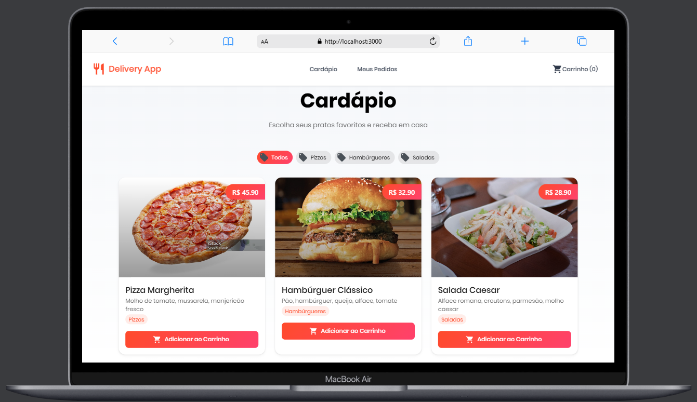
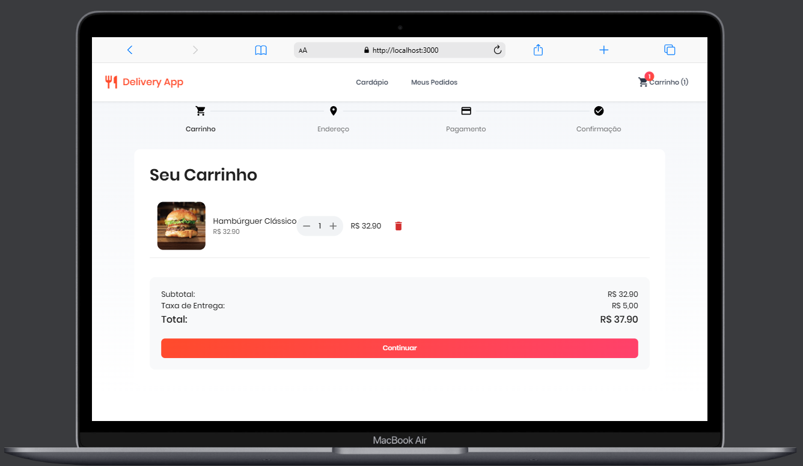
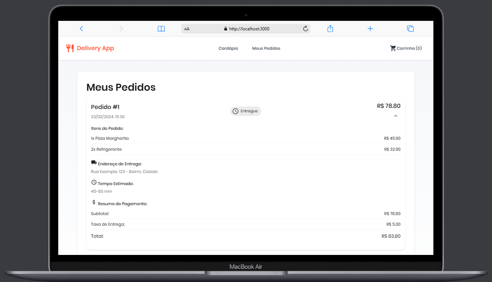
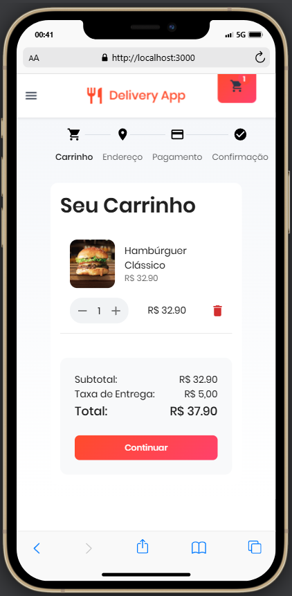
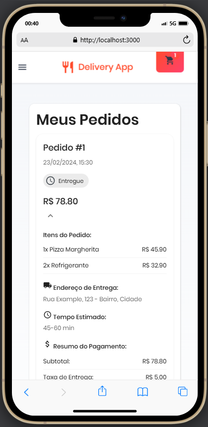

### Configuração do Backend

#### Entrar na pasta
`cd backend`
#### Instalar dependências
`npm install`
#### Configurar variáveis de ambiente
`cp .env.example .env`
#### Executar migrations
`npm run migrate`
#### Iniciar servidor
`npm run dev`

### Configuração do Frontend

#### Entrar na pasta
`cd frontend`
#### Instalar dependências
`npm install`
#### Iniciar aplicação
`npm start`

## 📸 Screenshots

### Desktop

  
  
  

### Mobile

  
  
  

## 🎯 Status do Projeto

🚧 Em desenvolvimento...

## 📝 Licença

Este projeto está sob a licença MIT. Veja o arquivo [LICENSE](LICENSE) para mais detalhes.

## 👨‍💻 Autor

Feito com ❤️ por [Breeno Cunha](https://github.com/breenocunha)

## 🤝 Contribuição

Contribuições são bem-vindas! Para contribuir:

1. Fork o projeto
2. Crie uma branch para sua feature (`git checkout -b feature/AmazingFeature`)
3. Commit suas mudanças (`git commit -m 'Add some AmazingFeature'`)
4. Push para a branch (`git push origin feature/AmazingFeature`)
5. Abra um Pull Request

## 📬 Contato

- LinkedIn: [Breeno Cunha](https://linkedin.com/in/breenocunha)
- Email: eltonestudos1@gmail.com
